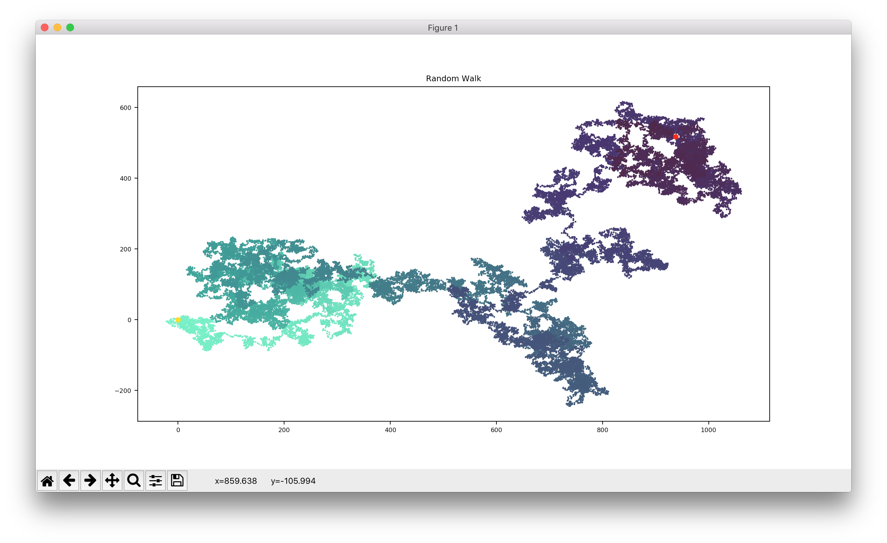

# python notes

## description
In my path to learning Python, I'll be collecting my notes and example code here for reference and review purposes. Filenames reflect the topic as much as possible. The data directory contains resources for some of the examples. To date, my training is self-guided through the use of text books and online resources.

## credits
Some examples and comments may come from the following:

- 'Python: Master the Art of Design Patterns' - *Phillips, Girighar, Kasampalis*
- 'Python Playground' - *Mahesh Venkitachalam*  
- 'Python Crash Course' - *Eric Matthes*  
- 'Introducing Python' - *Bill Lubanovic*  
- 'The Python 3 Standard Library by Example' - *Doug Hellmann*  
- 'Effective Python' - *Brett Slatkin*  
- 'The Flask Mega-Tutorial' - *Miguel Grinberg*
- 'Flask Web Development' - *Miguel Grinberg*
- 'Complete Python Masterclass' - *Udemy course*  
- 'The Python Mega Course: Build 10 Real World Applications' - *Udemy course*  
- 'REST APIs with Flask and Python' - *Udemy course*
- 'Think Python' - *Allen B. Downey*  
- 'Learn Python the Hard Way" - *Zed A. Shaw*  
- Python documentation - <https://docs.python.org/3/index.html>  

Very special thanks to [aleph2c](https://github.com/aleph2c) for the unending explanations, knowledge and support. Check out his epic [statechart library; Miros here](https://aleph2c.github.io/miros/index.html).

## images

From [**matplotlib_example.py**](matplotlib_example.py)  

